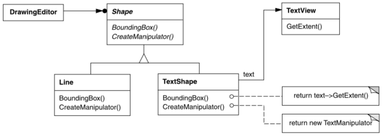

# reuseSoftEsp052019
Repositório de atividades para exercícios para disciplina de Reuso de Software -Arquitetura e Engenharia de Software

## Adapter

### Curiosidade
- Bastante abstrato para o mundo real.
- Para melhor compreensão os melhores exemplos são de problemas de software

### Problema
Problema (Extraído e editado do livro Padrões de Projeto e soluções reutilizáveis - ): 
Considere, por exemplo, um editor de desenhos que permite aos usuários desenhar e arranjar elementos gráficos (linhas, polígonos, texto, etc.) em figuras e diagramas. A interface para objetos gráficos é definida por uma classe abstrata chamada Shape. O editor define uma subclasse de Shape para cada tipo de objeto gráfico: uma classe LineShape para linhas, uma classe PolygonShape para polígonos, e assim por diante. Classes para formas geométricas elementares, como LineShape e PolygonShape, são bastante fáceis de ser implementadas, mas uma subclasse TextShape que pode exibir e editar textos é mais difícil de ser implementada, uma vez que mesmo a edição básica de textos envolve atualizações complicadas de tela e gerência de buffer. Entretanto, pode já existir uma biblioteca para construção de interfaces de usuários, o qual já oferece uma sofisticada classe TextView para a exibição e edição de textos. Idealmente, gostaríamos de reutilizar TextView para implementar TextShape, porém, a biblioteca de TextView não foi projetado levando classes Shape em consideração. Assim, não podemos usar de maneira intercambiável(Simplesmente efetuando a troca) objetos TextView e Shape. Como é possível que classes existentes e não relacionadas, funcionem em uma aplicação que espera classes com uma interface diferente e incompatível?

Mãos a obra... vamos implementar

